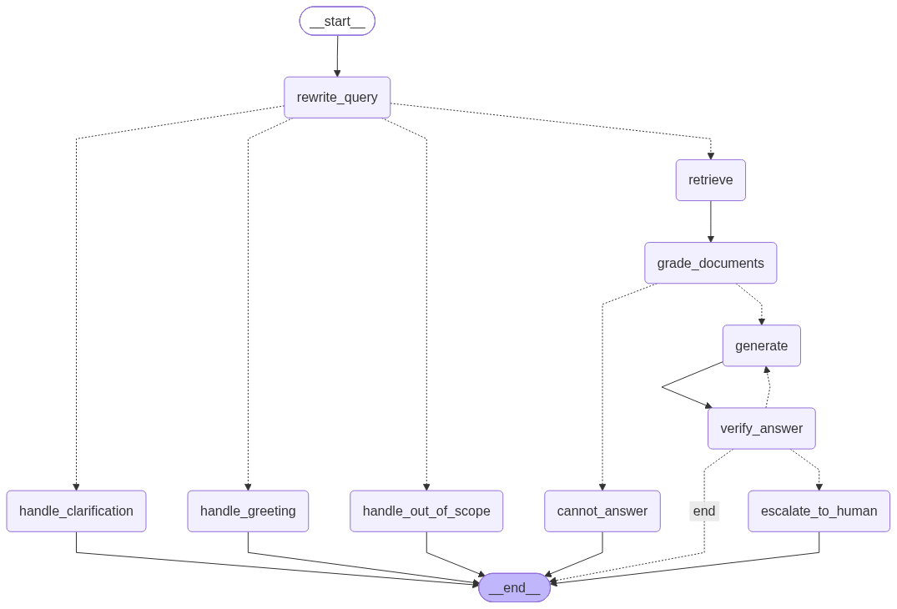

# PolicyGuard

**An agentic, self-correcting, evaluated RAG system for enterprise HR/IT policy Q&A.**

PolicyGuard answers employee questions strictly from a company's internal policy documents - with forced, verified citations, an LLM-driven hallucination check that retries itself before
answering, human-in-the-loop escalation with real checkpointing for anything it can't verify,
and a golden-dataset evaluation harness to measure all of it. It's built to demonstrate
production RAG engineering, not a demo notebook: every retrieval, generation, and safety
mechanism is designed, tested, and wired the way it would need to be for a real internal tool
handling real policy questions.

---

## Contents

- [PolicyGuard](#policyguard)
  - [Contents](#contents)
  - [Why this project exists](#why-this-project-exists)
  - [Architecture](#architecture)
  - [Key features](#key-features)
  - [Tech stack — why each piece is there](#tech-stack--why-each-piece-is-there)
  - [Project structure](#project-structure)
  - [Getting started](#getting-started)
  - [Quick Command Reference](#quick-command-reference)
  - [PDF support](#pdf-support)
  - [Managing policy documents](#managing-policy-documents)
  - [Usage](#usage)
  - [API \& UI](#api--ui)
  - [Containerization (Docker)](#containerization-docker)
  - [Testing](#testing)
  - [Evaluation \& results](#evaluation--results)
  - [Engineering highlights](#engineering-highlights)

---

## Why this project exists

Internal HR/IT questions ("how much sick leave do I get", "how often do I rotate my
password") are repetitive, but wrong answers on policy topics carry real compliance risk. A
generic chatbot that fabricates an answer when it's unsure is worse than useless here — it has
to know when it doesn't know, prove every claim against a real source, and hand off to a human
rather than guess. PolicyGuard is built around that constraint end-to-end: retrieval, grading,
generation, verification, and escalation all exist specifically to make wrong answers hard to
produce and easy to catch.

## Architecture



```
data/policies/*.md, *.pdf          data/eval/golden_dataset.json
       │                                       │
       ▼                                       ▼
┌─────────────────────┐              ┌──────────────────────┐
│  Ingestion Pipeline  │              │  Evaluation Harness   │
│  hierarchical chunk  │              │  4 metrics, LangSmith │
│  + table preservation│              │  experiment tracking  │
└──────────┬───────────┘              └───────────▲──────────┘
           ▼                                       │
┌───────────────────────────┐                      │
│   Chroma Vector Store      │                      │
│   parents + children       │◄────────┐            │
└──────────┬─────────────────┘         │            │
           │                    ┌──────┴───────┐    │
           ▼                    │  BM25 Index   │    │
┌────────────────────────────────────────────────────┴───────────────────┐
│                 LangGraph Orchestrator (StateGraph)                    │
│                                                                        │
│  rewrite_query → classify_intent                                       │
│       ├── (greeting) ─────────────► handle_greeting ────────────────┐  │
│       ├── (off-topic) ────────────► handle_out_of_scope ────────────┼─┐│
│       ├── (ambiguous query) ──────► handle_clarification ───────────┼─┼┤
│       └── (policy query) ─────────► retrieve (dense + BM25 → rerank)│ │ │
│                 → grade_documents ──(nothing relevant)──► cannot_ans│ │ │
│                 │ (relevant docs found)                             │ │ │
│                 ▼                                                   │ │ │
│              generate (forced citations) → verify_answer            │ │ │
│                 │              │                                    │ │ │
│                 │        (not grounded, retries left) ─► generate │ │ │
│                 │              │                                    │ │ │
│                 │        (retries exhausted) ─► escalate_to_human   │ │ │
│                 │                                   (interrupt +    │ │ │
│                 │                                    SQLite state)  │ │ │
│                 ▼                                                   ▼ ▼ ▼
│             grounded answer                                         END  
└────────────────────────────────────────────────────────────────────────┘
                          │
                          ▼
            answer + citations + audit trail
```

Every arrow above is a real, tested code path — not aspirational. See
[Build status / roadmap](#build-status--roadmap) for what's implemented vs. still planned.

## Key features

- **Hierarchical chunking with Markdown table preservation & PDF parent-child windowing.** Markdown policy docs are split by heading level (`##` parent sections, `###` child subsections) with table-block preservation (`| ... |`) so markdown table headers and rows are never severed across chunk boundaries. PDF docs generate parent context windows (~2000 chars) for complete LLM section context linked to precise child retrieval windows (~600 chars) via `parent_id`.
- **Smart Intent Guardrails & Pre-Retrieval Routing.** Fast intent classification checks incoming queries before vector search runs, routing non-policy questions away from retrieval:
  - *Greetings*: Inputs like `"hi"` or `"hello"` receive instant friendly welcome responses. A
    self-introduction (`"my name is Harshil"`, `"I'm Alex"`) is recognized as a greeting too and
    gets a personalized `"Hi Harshil!"` reply instead of being mistaken for a policy question.
  - *Out-of-Scope*: General trivia, math, or coding queries receive polite guidance explaining PolicyGuard's policy domain.
  - *Ambiguity Clarification*: Overly broad questions (*"tell me the policy"*) prompt the user to specify their policy topic area (Leave, WFH, IT, Expenses).
- **Hybrid retrieval, not just vector similarity.** Dense embedding search (Chroma) and BM25
  keyword search run over the same corpus and are fused with Reciprocal Rank Fusion, so an exact
  keyword match doesn't lose to a semantically-similar-but-wrong chunk. Fused candidates are then
  reranked by a cross-encoder-style hosted reranker (Cohere) before generation ever sees them.
- **Corrective RAG grading.** An LLM call filters retrieved sections down to the ones actually
  relevant to the question before generation runs — if nothing survives grading, the graph
  answers "I don't have enough information" instead of generating from irrelevant context.
- **Forced, *validated* citations.** Every generated claim must carry an inline
  `[source: doc_id, section]` tag, and a citation isn't trusted just because the model wrote it —
  it's checked against the actual retrieved context, and a citation pointing at content that was
  never retrieved is treated as a grounding failure, not a cosmetic one.
- **Conversational follow-ups, without letting the model answer from memory.** A caller (CLI,
  API, or UI) can pass prior Q&A turns alongside a new question, and `rewrite_query` uses them
  to resolve references like "does *this* apply to interns" or "what about *that*" into a
  standalone search query. The resolved query — not the raw, ambiguous one — is what grading and
  generation see, so retrieval and citation-checking work correctly on a follow-up. Conversation
  history is deliberately *never* shown to `generate` itself: every claim in the final answer
  still has to come from retrieved, graded policy excerpts, not from something said earlier in
  the chat.
- **A hallucination check that can act on what it finds.** A second LLM pass verifies the
  generated answer is fully supported by the retrieved context. If not, the graph loops back to
  `generate` (bounded retries) before giving up — it doesn't just log a "low confidence" score
  and ship the answer anyway.
- **Real human-in-the-loop, not a TODO comment.** When retries are exhausted, the graph pauses
  mid-execution via LangGraph's `interrupt()` and persists full state to a SQLite checkpoint
  under a `thread_id`. A *separate* CLI invocation, in a separate process, resumes it later with
  an approve/edit/reject decision — proving the "resumable across sessions" requirement rather
  than faking it with an in-memory `input()` prompt.
- **A real evaluation harness, not a vibe check.** A 49-example golden Q&A dataset (covering
  26 distinct sections of the ingested policy document plus 12 deliberately unanswerable
  questions) is scored on four metrics — two deterministic, two LLM-judged — locally or as a
  tracked LangSmith experiment.
- **Fully dependency-injected.** The LLM, retriever, reranker, and checkpointer are all
  swappable at the function-call boundary. The entire 103-test suite runs against fakes/temp
  local stores in ~20 seconds — no live API calls, no network flakiness, no API cost to run CI.

## Tech stack — why each piece is there

| Layer | Technology | What it's doing here |
| --- | --- | --- |
| LLM inference | **Groq** (Llama 3.x) via `langchain-groq` | Fast, free-tier-friendly inference for every LLM call in the graph — rewriting, grading, generation, verification, and evaluation judging all go through one interchangeable `BaseChatModel`. |
| Orchestration | **LangGraph** `StateGraph` | The centerpiece: models the agent as an explicit graph with conditional routing (`grade_documents` → generate or bail) and a real cycle (`verify_answer` → retry `generate`), not a linear chain pretending to be an agent. |
| Vector search | **ChromaDB** (persistent, local embeddings) | Stores parent/child chunk collections and runs dense similarity search — no external embedding API required. |
| PDF ingestion | **pypdf** | Pure-Python text extraction for PDF policy docs (no compiled/native deps) — no torch-style wheel-availability risk. |
| Keyword search | **rank-bm25** | Classic sparse retrieval over the same child chunks, built in-memory from the Chroma collection — catches exact-term queries dense embeddings can miss. |
| Fusion | Reciprocal Rank Fusion (hand-rolled) | Combines the dense and BM25 rankings into one candidate pool without needing either signal to dominate by construction. |
| Reranking | **Cohere** Rerank API | Cross-encoder-quality reranking of the fused candidates. (A local `sentence-transformers` cross-encoder was the first choice — see [Engineering highlights](#engineering-highlights) for why that had to change.) |
| Prompts / messages | **langchain-core** | `SystemMessage`/`HumanMessage` primitives and `BaseChatModel` typing, used directly rather than through a heavier chain abstraction that the graph doesn't need. |
| Human-in-the-loop | **LangGraph** `interrupt()` / `Command(resume=...)` | Pauses graph execution mid-node and resumes it later from an entirely different process invocation. |
| Persistence | **langgraph-checkpoint-sqlite** | Durable, on-disk checkpointing of full graph state per `thread_id`, so paused conversations survive process restarts. |
| Evaluation & tracing | **LangSmith** | Optional hosted experiment tracking: uploads the golden dataset once, then logs each evaluation run as a comparable, traced experiment. |
| Config | **python-dotenv** | Loads API keys from a gitignored `.env` — nothing secret is hardcoded or committed. |
| API | **FastAPI** | Thin HTTP wrapper around the same compiled graph the CLI uses — `/ask` and `/resolve`, including the interrupt/resume flow, over a stable JSON contract instead of stdin/stdout. |
| UI | **Streamlit** | Minimal chat UI on top of the API — question in, cited answer out, with approve/edit/reject controls when a thread pauses for human review. |
| Testing | **pytest** | 103 tests across every layer, built almost entirely on fakes (`FakeLLM`, `FakeCohereClient`) and real-but-temporary Chroma stores (`tmp_path`) instead of mocking/patching internals. |
| Containerization | **Docker** / Compose | An `api` + `ui` service pair sharing one image, plus a one-off `ingest` profile — persists `chroma_db` and `checkpoints.sqlite` to the host and reuses the host's Chroma embedding-model cache instead of re-downloading it per container. |

## Project structure

```
policyguard/
├── data/
│   ├── policies/                 # Policy docs to ingest (Markdown + YAML front matter, or PDF)
│   └── eval/golden_dataset.json  # 49-example golden Q&A set (question, answer, source, answerable)
├── src/policyguard/
│   ├── ingestion/                # Loading, chunking, Chroma vector store
│   │   ├── loader.py             #   Markdown: parses YAML front matter + body
│   │   ├── pdf_loader.py         #   PDF: extracts text, reads sidecar .yaml (or guesses defaults)
│   │   ├── chunker.py            #   Markdown: ## → parent, ### → child + table preservation. PDF: parent-child windows
│   │   ├── vectorstore.py        #   Chroma-backed store: query, get-by-id, get-all, delete
│   │   └── ingest.py             #   CLI: ingest docs (.md or .pdf) / run a raw retrieval query
│   ├── generation/                # Linear "baseline" generate-with-citations chain
│   │   ├── chain.py               #   retrieve → prompt → LLM → validate citations
│   │   ├── prompts.py             #   forced-citation system prompt
│   │   ├── citations.py           #   citation parsing + validation
│   │   └── ask.py                 #   CLI
│   ├── retrieval/                  # Hybrid search + reranking
│   │   ├── bm25.py                 #   BM25 index over child chunks
│   │   ├── hybrid.py               #   dense + BM25 fusion via RRF
│   │   └── reranker.py             #   Cohere rerank wrapper
│   ├── orchestration/               # The LangGraph StateGraph
│   │   ├── state.py                 #   GraphState schema
│   │   ├── nodes.py                 #   nodes, intent classifiers (greeting/out-of-scope/ambiguity), routing
│   │   ├── graph.py                 #   graph wiring / compilation
│   │   ├── ask.py                   #   CLI: ask a question through the graph
│   │   └── resolve.py               #   CLI: resume a paused/escalated conversation
│   ├── evaluation/                   # Golden dataset + evaluators
│   │   ├── dataset.py                 #   golden example loader
│   │   ├── evaluators.py              #   recall@k, citation_accuracy, faithfulness, answer_relevance
│   │   └── run_eval.py                #   CLI: local scorecard or LangSmith experiment
│   ├── api/                          # FastAPI wrapper around the compiled graph
│   │   ├── app.py                     #   /ask, /resolve, /health
│   │   └── schemas.py                 #   request/response pydantic models
│   └── ui/                           # Minimal Streamlit UI
│       └── app.py                     #   chat UI calling the API, incl. review approve/edit/reject & clear chat
└── tests/                              # 103 tests, one file per module above
```

## Getting started

```bash
git clone <repo-url> && cd policyguard
python3 -m venv .venv
source .venv/bin/activate
pip install -e ".[dev,ui]"   # add `,ui` only if you want the Streamlit UI

cp .env.example .env
# then edit .env and add your API keys (see below)
```

`.env` variables:

| Variable | Required for | Notes |
| --- | --- | --- |
| `GROQ_API_KEY` | Everything past ingestion | Free tier at [console.groq.com](https://console.groq.com/keys) |
| `GROQ_MODEL` | — | Defaults to `llama-3.3-70b-versatile` |
| `COHERE_API_KEY` | Reranking (or pass `--no-rerank`) | Free tier at [dashboard.cohere.com](https://dashboard.cohere.com/api-keys) |
| `LANGSMITH_API_KEY` | `run_eval --langsmith` only | Optional — local eval mode works without it |

Drop your own policy docs (Markdown or PDF) into `data/policies/`, then ingest them into a local
Chroma store:

```bash
python -m policyguard.ingestion.ingest --input data/policies --persist-dir ./chroma_db
```

## Quick Command Reference

Here is a quick summary of essential commands for running, managing, and clearing PolicyGuard:

### 1. Clear / Reset Vector DB (Clean Fresh Start)
To wipe the existing Chroma DB vector store and clear all past chunk embeddings:
```bash
python -c "import shutil; shutil.rmtree('./chroma_db', ignore_errors=True); print('Chroma DB vector store cleared!')"
```

### 2. Ingest Policy Documents
To ingest Markdown (`.md`) or PDF (`.pdf`) policy files from `data/policies/` into Chroma DB:
```bash
python -m policyguard.ingestion.ingest --input data/policies --persist-dir ./chroma_db
```

### 3. Check Vector DB Chunk Count
To verify how many parent and child chunks are currently indexed in Chroma DB:
```bash
python -c "from pathlib import Path; from policyguard.ingestion.vectorstore import PolicyVectorStore; store = PolicyVectorStore(Path('./chroma_db')); print('Parents:', store._parents.count(), 'Children:', store._children.count())"
```

### 4. Run Web Application (API + UI)
- **Step 1: Start FastAPI Service (Backend):**
  ```bash
  uvicorn policyguard.api.app:app --reload
  ```
- **Step 2: Start Streamlit Interface (Frontend - in a new terminal tab):**
  ```bash
  streamlit run src/policyguard/ui/app.py
  ```

### 5. Run CLI Interactive Mode
```bash
python -m policyguard.orchestration.ask
```

### 6. Run Test Suite
```bash
pytest
```

## PDF support

`data/policies/` (or any `--input` directory) can mix `.md` and `.pdf` policy docs. A PDF has
no YAML front matter and no `##`/`###` heading structure to hierarchically chunk by, so:

- **Metadata** comes from an optional sidecar YAML file with the same name: `finance_policy.pdf` +
  `finance_policy.yaml`, with the same four fields as Markdown front matter:
  ```yaml
  doc_id: finance-expense-policy
  department: Finance
  effective_date: 2026-01-01
  version: 1.0
  ```
  If a sidecar exists, all four fields are required. If there's no sidecar at all, a PDF can
  still be dropped in with zero setup — metadata is auto-generated from the filename (`doc_id`
  slugified from the stem, `department` guessed from keywords like "hr"/"security"/"finance",
  `effective_date` defaulted to today, `version` to `"1.0"`), with a printed warning so it's
  obvious the values were guessed rather than authored.
- **Chunking** generates parent context windows (~2000 chars) for full generation context and child retrieval windows (~600 chars) linked via `parent_id` — each section cited as `[source: doc_id, Part N]` with table structure (`| ... |`) preserved.

Text extraction uses `pypdf` (pure Python, no compiled/native dependencies). Ingest exactly the
same way — the CLI auto-detects file type by extension:

```bash
python -m policyguard.ingestion.ingest --input data/policies --persist-dir ./chroma_db
```

## Managing policy documents

Ingestion always `upsert`s — it can add or update, but it never removes. Whether re-running it
after a change is enough, or you need to clean up manually, depends on what changed:

| You changed... | What to do | Why |
| --- | --- | --- |
| Content within an existing section (same file, same `doc_id`, same heading) | Just re-run ingestion | Chunk IDs are deterministic hashes of `doc_id` + section title, so the same chunk gets overwritten in place. Safe, idempotent, no cleanup needed. |
| A section's heading text, or removed a section | Re-run ingestion, **then** manually remove the orphaned chunk | The old heading produces a different chunk ID than the new one, so the old chunk is never overwritten — it just sits there, findable by retrieval, pointing at content that no longer exists in the source file. |
| A `doc_id` (front matter, sidecar YAML, or a PDF filename with no sidecar — its `doc_id` is guessed from the filename) | Delete the **old** `doc_id` before or after ingesting under the new one | Same root cause as above, at the whole-document level: the store now has two `doc_id`s for what you consider one logical document. |
| Removed a policy file entirely | Delete its `doc_id` | Ingestion only ever processes files it currently finds in `--input` — it has no notion of "this used to exist and doesn't anymore." |

There's no CLI command for cleanup yet — do it directly:

```bash
python -c "
from pathlib import Path
from policyguard.ingestion.vectorstore import PolicyVectorStore

store = PolicyVectorStore(Path('./chroma_db'))
store.delete_document('the-old-doc-id')
"
```

To see what's actually in the store (useful before deleting anything, or after a re-ingest to
sanity-check what landed):

```bash
python -c "
from pathlib import Path
from collections import Counter
from policyguard.ingestion.vectorstore import PolicyVectorStore

store = PolicyVectorStore(Path('./chroma_db'))
_, _, metadatas = store.get_all_children()
print(Counter(m['doc_id'] for m in metadatas))
"
```

This gap (upsert-only, no automatic pruning of stale `doc_id`s) is a known limitation — see
[Engineering highlights](#engineering-highlights) for two real incidents it caused.

## Usage

**Raw retrieval only** (no LLM, sanity-checks ingestion):
```bash
python -m policyguard.ingestion.ingest --query "how many carryover leave days am I allowed"
```

**Simple baseline chain** (retrieve → generate with citations, no grading/self-correction):
```bash
python -m policyguard.generation.ask "how many carryover leave days am I allowed"
```

**Full agentic pipeline** (hybrid retrieval + reranking + grading + hallucination check):
```bash
python -m policyguard.orchestration.ask "how many carryover leave days am I allowed"
python -m policyguard.orchestration.ask "..." --no-rerank   # skip Cohere, no key needed
python -m policyguard.orchestration.ask   # omit the question for interactive mode
```
If the answer can't be verified as grounded after retries, this prints a `thread id` and pauses
instead of returning an answer. Interactive mode remembers the session's prior questions and
answers, so a follow-up like "does this apply to interns" resolves against what was already
asked (see [Key features](#key-features)).

**Resolve a paused/escalated conversation** (a separate process, proving real resumability):
```bash
python -m policyguard.orchestration.resolve --thread-id <id> --action approve
python -m policyguard.orchestration.resolve --thread-id <id> --action edit --answer "..."
python -m policyguard.orchestration.resolve --thread-id <id> --action reject
```

**Run the evaluation suite:**
```bash
python -m policyguard.evaluation.run_eval                # local scorecard
python -m policyguard.evaluation.run_eval --langsmith     # + tracked LangSmith experiment
```

## API & UI

A FastAPI service exposes the same compiled LangGraph app the CLI uses, over HTTP instead of
stdin/stdout — same hybrid retrieval, grading, hallucination check, and human-in-the-loop
escalation, just a different front door. Setup (Chroma connection, BM25 index, LLM, checkpointer,
graph compilation) happens once at process startup and is shared across every request.

```bash
uvicorn policyguard.api.app:app --reload
```

| Endpoint | Method | Purpose |
| --- | --- | --- |
| `/ask` | POST | `{"question": "...", "history": [...]}` → `{"status": "answered" \| "cannot_answer" \| "needs_review", "answer": ..., "citations": [...], ...}` |
| `/resolve` | POST | `{"thread_id": ..., "action": "approve" \| "edit" \| "reject", "answer": ...}` — resumes a thread paused by `/ask` |
| `/health` | GET | Liveness check |

A `needs_review` response means the answer couldn't be verified as grounded after retries; it's
paused (checkpointed, exactly like the CLI's escalation) until a `/resolve` call decides its fate
— from the same request, a later one, or an entirely different client.

`history` is optional and defaults to `[]` — pass prior turns
(`[{"question": ..., "answer": ...}, ...]`, oldest first) so a follow-up question like "does this
apply to interns" can be resolved against what was already asked. The API is otherwise stateless
across calls, so accumulating and resending history is the caller's responsibility — the
Streamlit UI does this automatically from its own chat history.

A minimal Streamlit UI sits on top of the API — a chat box in, a cited answer out, with
approve/edit/reject buttons that appear automatically when a thread pauses for review:

```bash
# with the API already running (see above)
streamlit run src/policyguard/ui/app.py
```

## Containerization (Docker)

The whole stack (API + UI) also runs without a local Python environment at all — just Docker.

```bash
cp .env.example .env   # if you haven't already; the containers read the same file
docker compose up -d api ui
```

- **API** → http://localhost:8000 (`/health`, `/ask`, `/resolve`, `/docs`)
- **UI** → http://localhost:8501 (talks to the `api` service by its Compose network name, via
  the `POLICYGUARD_API_URL` env var — no manual URL entry needed)

Re-run ingestion inside a container (useful if you don't want `pip install`ed locally at all):

```bash
docker compose --profile tools run --rm ingest
```

```bash
docker compose down            # stop everything
docker compose logs -f api     # tail a service's logs
```

A few things about how this is wired, worth knowing before you change it:

- **[Dockerfile](./Dockerfile)** is a single `python:3.11-slim` stage with no compiler toolchain
  — every dependency here (`chromadb`, `onnxruntime`, `pypdfium2`, `opencv-python` via
  `rapidocr-onnxruntime`) ships a prebuilt manylinux wheel, so `build-essential` isn't needed and
  skipping it keeps both the image and the build itself lighter. The only apt packages installed
  are `libgl1`/`libglib2.0-0`, which `opencv-python` needs at runtime.
- **[docker-compose.yml](./docker-compose.yml)** defines `api`, `ui`, and a one-off `ingest`
  profile, all built from the same image. `chroma_db/` and `checkpoints.sqlite` are bind-mounted
  to the host so the vector store and LangGraph checkpoints persist across `docker compose down`
  the same way they would running locally.
- It also bind-mounts `~/.cache/chroma` into the containers. Chroma's default embedding function
  lazily downloads a ~79 MB ONNX model (`all-MiniLM-L6-v2`) on first use; without this mount, a
  fresh container re-downloads it on every rebuild, which is slow on a constrained connection.
  Reusing the host's copy means containers start warm.
- The `api` service has a Compose healthcheck against `/health`; `ui` declares
  `depends_on: api: condition: service_healthy`, so the UI never starts pointing at a backend
  that isn't ready yet.

## Testing

```bash
pytest
```

103 tests, ~20 seconds, zero live API calls:

| File | Tests | Covers |
| --- | --- | --- |
| `test_chunker.py` | 8 | Hierarchical chunking, parent/child linking, metadata propagation |
| `test_pdf_ingestion.py` | 21 | Flat window chunking, overlap, sidecar YAML metadata validation, guessed-default fallback |
| `test_chain.py` | 5 | Context-block deduping, prompt construction |
| `test_citations.py` | 4 | Citation parsing + validation |
| `test_retrieval.py` | 9 | BM25 exact-match, RRF fusion, Cohere reranker (via fake client) |
| `test_orchestration.py` | 37 | Every node, every routing decision (incl. self-introduction greetings), conversation-history resolution, full-graph integration incl. interrupt/resume, via a `FakeLLM` |
| `test_evaluation.py` | 16 | Dataset integrity, both programmatic metrics, both LLM-judge metrics (via fake LLM) |
| `test_vectorstore.py` | 2 | `delete_document` removes only the targeted doc's chunks, no-ops for an unknown doc id |
| `test_api_streaming.py` | 1 | Streaming `/ask` response shape |

The orchestration tests are the ones worth highlighting: they run the **actual compiled
LangGraph app** — including the interrupt/checkpoint/resume cycle against a real
`InMemorySaver` — with only the LLM swapped for a scripted fake, so the graph wiring itself is
verified, not just each node in isolation.

## Evaluation & results

Latest run of the full 49-example golden dataset against the real ingested policy document
(`hr-policy-dec-2025`, a 38-page government HR/admin policy PDF), with `llama-3.3-70b-versatile`:

| Metric | Score |
| --- | --- |
| recall@k | 0.88 |
| citation_accuracy | 0.61 |
| faithfulness | 1.00 |
| answer_relevance | 0.98 |

Faithfulness is perfect across all 49 questions — no hallucinated claims. citation_accuracy is
the weak spot, and `run_eval`'s per-example failure log points at two distinct, fixable causes
rather than one vague "citations are unreliable":

1. **Citations omitted on correct answers.** Several answers are factually right but ship with
   no `[source: ...]` tag at all, so `citation_accuracy` scores 0 even though nothing is
   factually wrong.
2. **Citation granularity drift.** The model sometimes cites a sub-clause or appendix label
   (`Part 14(b)(i)`, `Part VI (g)`, `Appendix-A, 5`) instead of the exact `Part N` string the
   chunk is actually indexed under, so citation-validation rejects it as an "invalid citation"
   even when it's pointing at essentially the right place.

recall@k misses are concentrated on facts that sit in overlapping/boundary-adjacent chunks (e.g.
a leave entitlement whose full description spans two consecutive `Part N` sections) — retrieval
sometimes surfaces the semantically-similar neighbor chunk instead of the exact one the golden
example was graded against.

## Engineering highlights

A few things worth calling out that came from actually exercising the system against a live
LLM, not just reading the architecture doc:

- **Found and fixed a real citation-accuracy bug.** The LLM would sometimes cite a `###`
  subsection heading it saw *inside* an excerpt's body text instead of the parent section given
  in that excerpt's own `[source: ...]` tag. Caught by the citation-validation layer, but the
  graph wasn't acting on it — a bad citation could still reach the user as long as the answer's
  prose was independently judged "faithful." Fixed at two levels: tightened the generation
  prompt to explicitly disallow it, and wired citation validity into the groundedness check so
  the self-correction loop treats a bad citation as a verification failure, not a footnote.
- **Distinguished evaluator bugs from system bugs.** A first baseline run showed
  faithfulness/relevance failures with no visible reason. Fixing the evaluator to surface the
  judge's actual reasoning (instead of just a score) revealed the *judge* was wrong, not the
  system: it failed closed on answers with zero factual claims (a correct "I don't know" has
  nothing to be unsupported — it's vacuously faithful), and it penalized correctly-declined
  out-of-scope questions using its own world knowledge instead of respecting that this assistant
  is deliberately restricted to the policy corpus. Both judge prompts were corrected accordingly.
- **Hit a real platform constraint and adapted rather than fought it.** The architecture doc's
  suggested local cross-encoder reranker needs `sentence-transformers`/`torch`, which has no
  installable wheel for an Intel/x86_64 Mac on Python 3.13 (recent PyTorch macOS builds are
  Apple-Silicon-only). Rather than forcing it, reranking moved to a hosted API (Cohere) behind
  the same interface, with a `--no-rerank` escape hatch that needs no key at all.
- **Found a second stale-context bug while adding conversational memory.** After wiring
  conversation history into `rewrite_query`, a live follow-up question ("does this apply to
  interns") still failed — retrieval found the right excerpt, but `grade_documents` and
  `generate` were still being prompted with the raw, ambiguous question text, not the
  disambiguated `rewritten_query`. The grader/generator has no access to conversation history by
  design (so answers can't smuggle in unretrieved "facts" from earlier in the chat), so an
  unresolved "this" was unanswerable to them even with the correct excerpt in hand. Fixed by
  routing `rewritten_query` through both nodes instead of `question`.
- **Caught a corpus contamination issue the same follow-up question exposed.** Even after that
  fix, the same live question came back wrong until digging into what was actually retrieved: the
  vector store held chunks from two unrelated organizations' HR policies under different
  `doc_id`s (the real company policy, plus an unrelated government HR manual that had been
  ingested at some point) — Cohere's reranker had no way to know which org "this" referred to, so
  it silently arbitrated between them. `delete_document()` (added earlier for a different
  duplicate) removed the stray document; confirms that data hygiene, not model capability, was
  the recurring root cause across multiple debugging sessions.
- **Idempotent ingestion by construction.** Chunk IDs are deterministic hashes of `doc_id` +
  slugified section title, and storage uses `upsert`, not `add` — re-running ingestion on
  unchanged docs is a safe no-op rather than a source of duplicate vectors. Upserting alone never
  *removes* anything, though — a real duplicate-document incident (the same policy ingested once
  as Markdown and once as a differently-`doc_id`'d PDF) surfaced that gap directly, which is why
  `PolicyVectorStore.delete_document(doc_id)` exists: it clears every parent/child chunk under a
  doc_id before a rename/replace/removal leaves orphaned vectors behind.
- **Rebuilt the golden dataset against the real corpus instead of trusting stale fixtures.**
  When the sample policy docs were swapped for a real 38-page government HR/admin PDF, the
  existing 24-example golden dataset kept referencing `doc_id`s (`hr-leave-policy`,
  `it-security-policy`) that no longer existed in the store — every IT-security question was
  silently unanswerable by construction, not because of a retrieval bug. Every one of the 49
  replacement examples was written by reading the actual ingested parent chunks back out of
  Chroma first, so `expected_doc_id`/`expected_section` are ground truth, not guesses.
- **A regex-based intent router had a silent blind spot for self-introductions.** Typing "my
  name is Harshil" skipped the greeting path entirely — `is_greeting()` only matched a fixed set
  of greeting words, so the message fell through to full RAG retrieval, got paraphrased by the
  query-rewrite LLM into something search-shaped, and returned a confidently-cited but nonsensical
  answer about the onboarding/induction policy. Fixed by extending intent classification to
  recognize self-introduction phrasing (`"my name is X"`, `"I'm X"`, `"call me X"`) and routing it
  through the same no-retrieval greeting path, now with a personalized reply.


